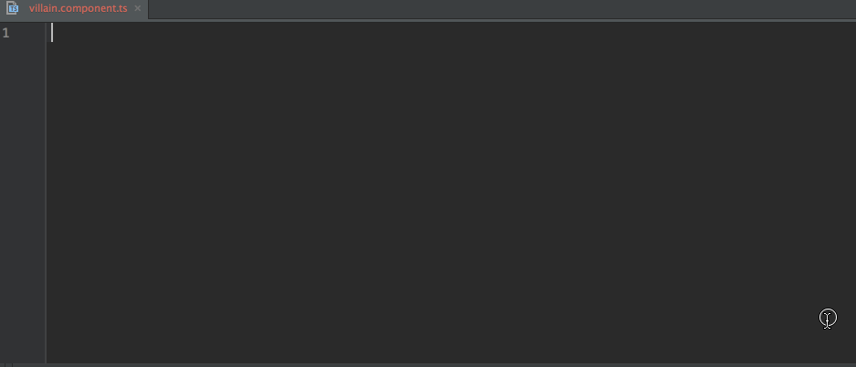
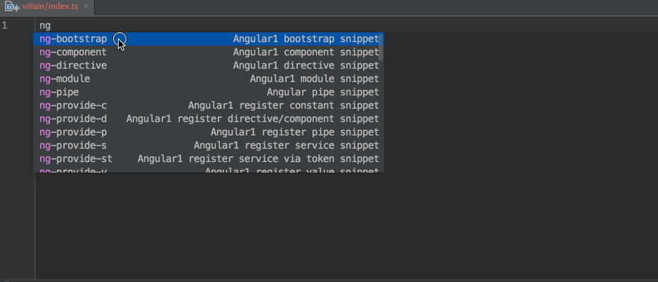

# Angular 1 + ngMetadata Typescript Snippets for JetBrains products

This Live Template Group for JetBrains products adds snippets for Angular 1 with [ng-metadata](https://github.com/ngParty/ng-metadata) for TypeScript.

> based on [@johnpapa](https://twitter.com/John_Papa) [vsCode snippets](https://github.com/johnpapa/vscode-angular2-snippets).

> create component



> create Module



## Usage
Type part of a snippet, press `tab`, and the snippet unfolds.

## TypeScript Snippets
```
ng-bootstrap
ng-component
ng-directive
ng-pipe
ng-service
ng-module
ng-provide-d
ng-provide-s
ng-provide-st
ng-provide-p
ng-provide-c
ng-provide-v
```

Alternatively, press `Ctrl+J` (Windows, Linux) or `Cmd+J` (OSX) to activate snippets from within the editor.


## Installation
There are two ways to do this:

- Store a copy of the `Angular1-ngMetadata-Snippets.xml` file in the corresponding [templates](https://www.jetbrains.com/help/idea/2016.1/live-templates.html) folder.
- Follow the [instructions](https://www.jetbrains.com/help/idea/2016.1/sharing-live-templates.html) under **To paste the live templates**